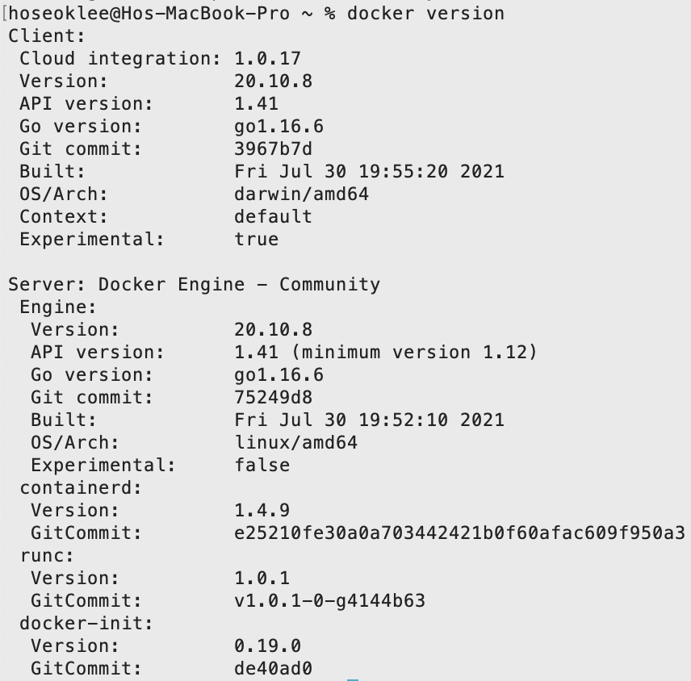
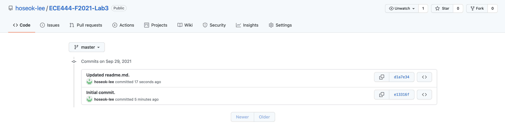
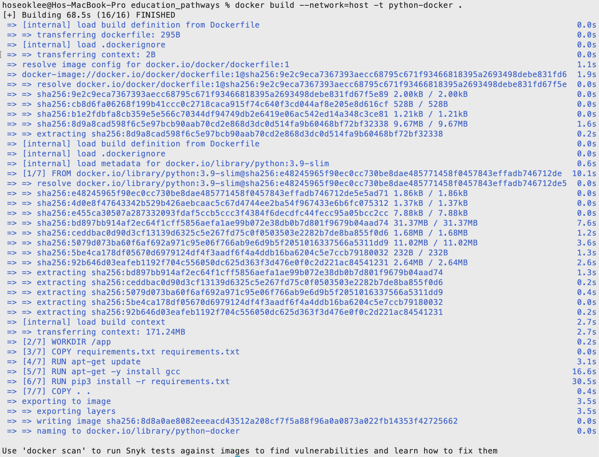
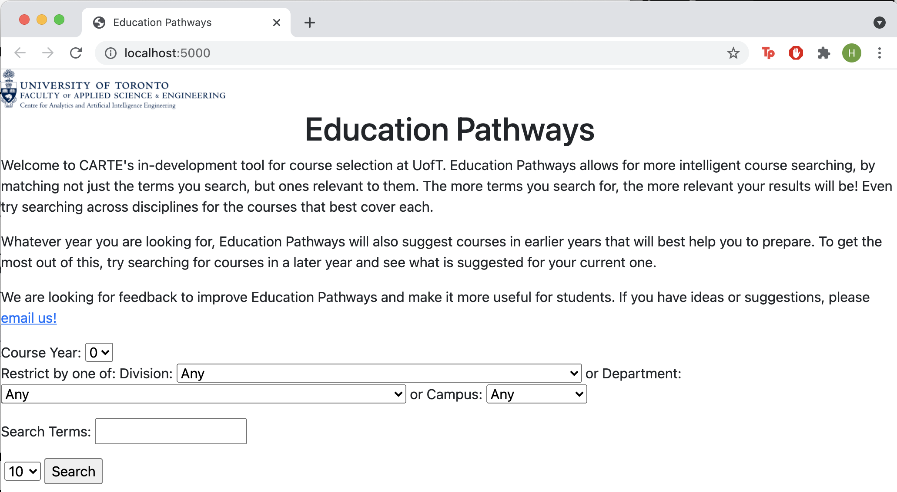
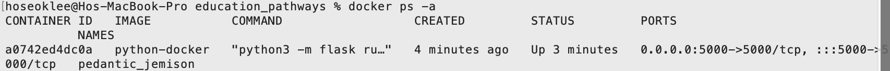

Ho Seok Lee

This repo is a clone of https://github.com/nelaturuk/education_pathways.

# Activity 1

# Activity 2

# Activity 3

# Activity 4

# Activity 5

A functional requirement I would like to improve is to incorporate the syllabus and related syllabus information in the Education Pathways tool. Information such as professors, lecture rooms, and lecture times would be helpful in such a tool.

A non-functional requirement I would like to improve is to allow search queries with more than one keyword to be considered as contextual queries, and searches should be ordered in terms of best fitting context. For example, if "operating system" is searched, all courses with titles and/or descriptions with the keyword "operating" and/or "system" independently are shown, but ordered in terms of course level. Instead, the keywords can be  treated as a whole. If a course either had the entire query "operating system" or both "operating" and "system", it would be considered to be better fitting the context, and would appear higher in the search results.